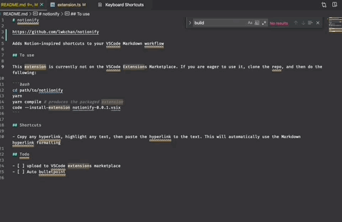

# notionify

https://github.com/lwkchan/notionify

Adds Notion-inspired shortcuts to your VSCode Markdown workflow

## To use

This extension is currently not on the VSCode Extensions Marketplace. If you are eager to use it, clone the repo, and then do the following:

```bash
cd path/to/notiionify
yarn
yarn compile # produces the packaged extension
code --install-extension notionify-0.0.1.vsix
```

## Shortcuts

- Copy any hyperlink, highlight any text, then paste the hyperlink to the text. This will automatically use the Markdown hyperlink formatting



## Todo

- [ ] upload to VSCode extensions marketplace
- [ ] Auto bulletpoint
